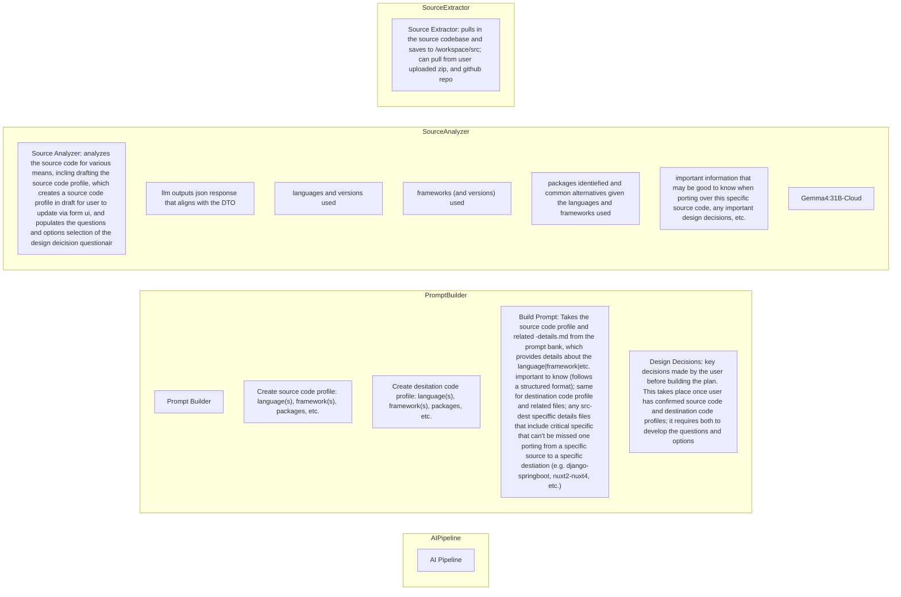

# API Architecture Design

```mermaid
flowchart LR
    %% following use-case driven clean architecture
    subgraph AIPipeline
        aip["AI Pipeline"]
    end
    
    subgraph PromptBuilder
        pb["Prompt Builder"]
        %% use cases
        a["Create source code profile: language(s), framework(s), packages, etc."]
        b["Create desitation code profile: language(s), framework(s), packages, etc."]
        c["Build Prompt: Takes the source code profile and related <language|framework|etc.>-details.md from the prompt bank, which provides details about the language|framework|etc. important to know (follows a structured format); same for destination code profile and related files; any src-dest speciffic details files that include critical specific that can't be missed one porting from a specific source to a specific destiation (e.g. django-springboot, nuxt2-nuxt4, etc.)"]
        d["Design Decisions: key decisions made by the user before building the plan. This takes place once user has confirmed source code and destination code profiles; it requires both to develop the questions and options"]
    end
    
    subgraph SourceAnalyzer
        sa["Source Analyzer: analyzes the source code for various means, incling drafting the source code profile, which creates a source code profile in draft for user to update via form ui, and populates the questions and options selection of the design deicision questionair"]
        DSPy["llm outputs json response that aligns with the DTO"]
            %% user ui source profile form is populated from below
            %% language and version populats Languages in the ui which is a editble list of languages (user can add, delete, update client side)
            lv["languages and versions used"]
            %% framework and version populates a Framework list in the ui which is editable list of languages (user can add, delete, update client side)
            fw["frameworks (and versions) used"]
            %% packages populates the Packages list in the ui which is a editble list of Packages (user can add, delete, update client side)
            pckgs["packages identiefied and common alternatives given the languages and frameworks used"]
            %% populates the Important Information, which is editable by end user via ui
            ii["important information that may be good to know when porting over this specific source code, any important design decisions, etc."]
        OLLAMA["Gemma4:31B-Cloud"]
    end

    subgraph SourceExtractor
        se["Source Extractor: pulls in the source codebase and saves to /workspace/src; can pull from user uploaded zip, and github repo"]
    end
```